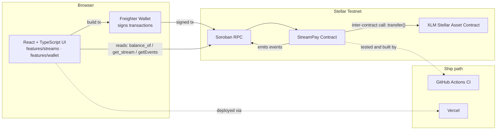
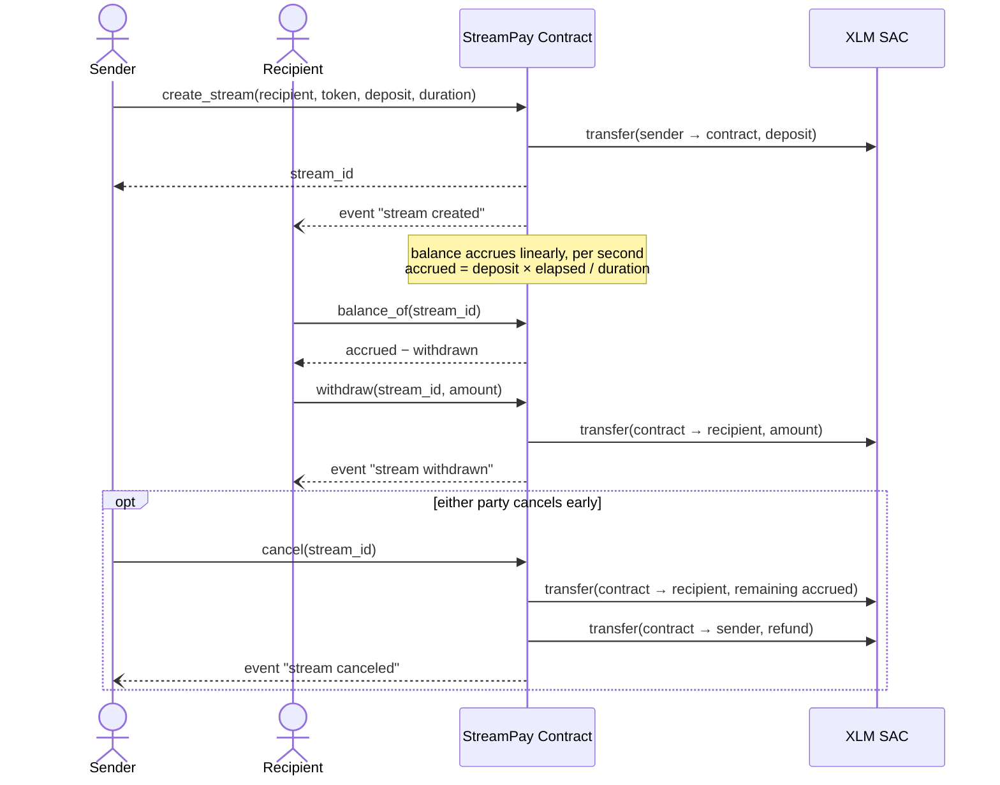
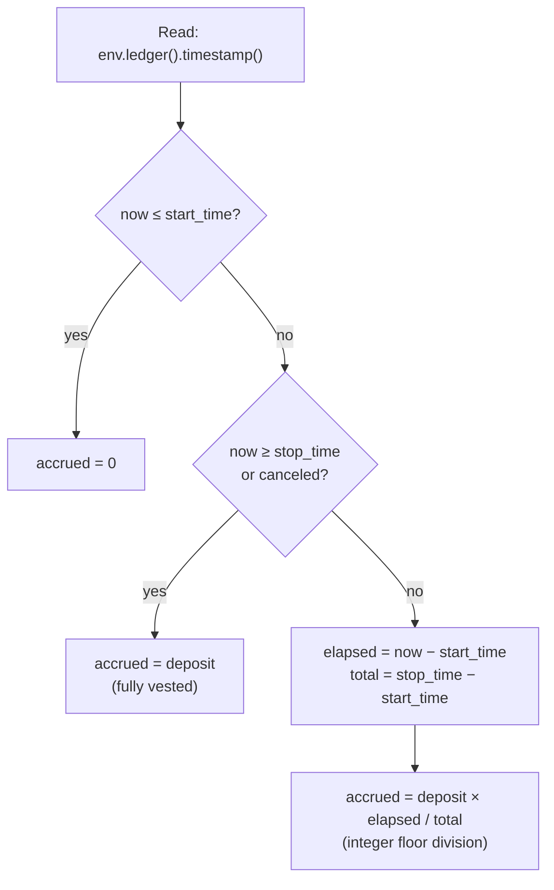
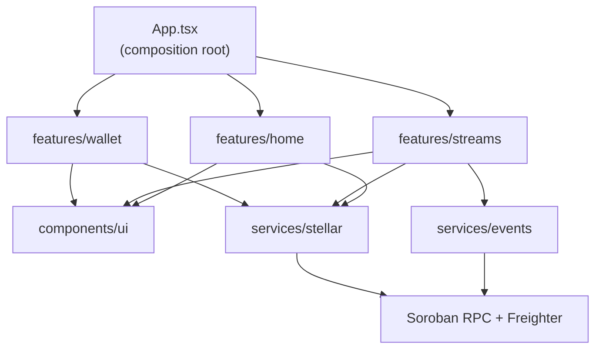
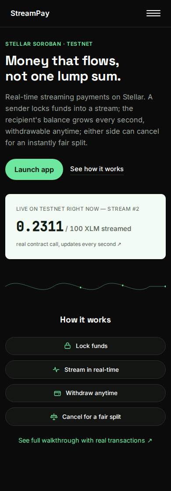
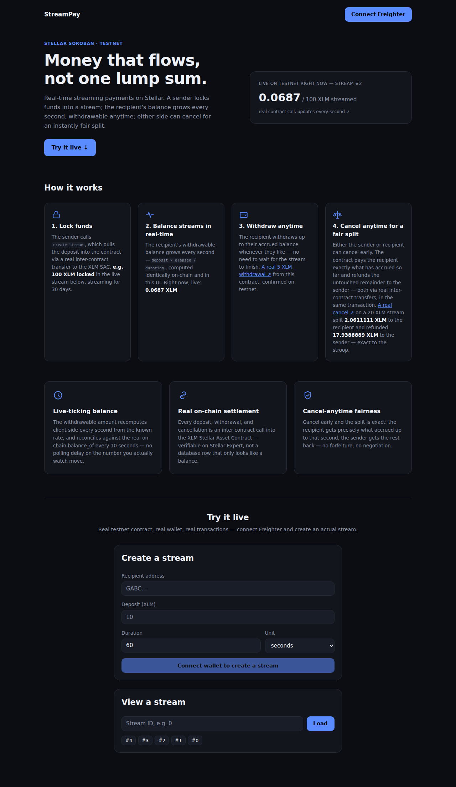
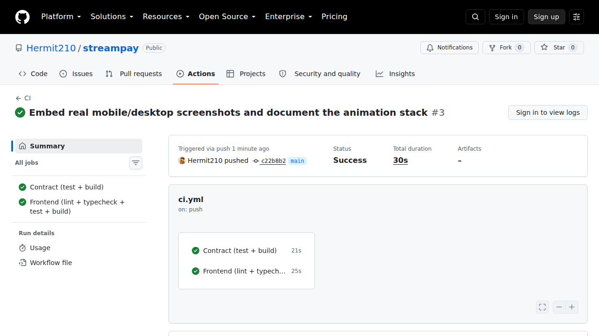
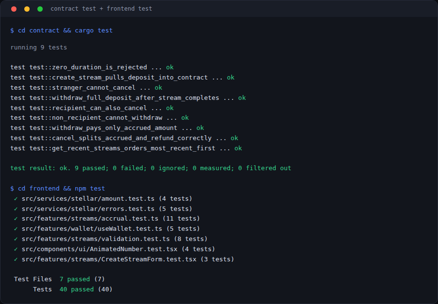

# StreamPay

[](https://github.com/Hermit210/streampay/actions/workflows/ci.yml)

Real-time streaming payments on Stellar Soroban — Orange Belt (Level 3) of
[Stellar Journey to Mastery](https://www.risein.com/programs/stellar-journey-to-mastery-monthly-builder-challenges).

## Contents

- [What this is](#what-this-is)
- [How this compares to earlier belts](#how-this-compares-to-earlier-belts)
- [Where this fits (use cases)](#where-this-fits-use-cases)
- [System architecture](#system-architecture)
- [How a stream flows, end to end](#how-a-stream-flows-end-to-end)
- [Accrual math, visually](#accrual-math-visually)
- [Contract](#contract)
- [Frontend](#frontend)
- [Setup](#setup)
- [Testnet deployment](#testnet-deployment)
- [Screenshots](#screenshots)
- [Requirements checklist](#requirements-checklist)

## What this is

A sender locks XLM into a **stream** addressed to a recipient over a fixed
duration. Instead of unlocking all at once like a normal payment, the
recipient's withdrawable balance grows **continuously, per second**. The
recipient can withdraw their accrued balance at any time; either party can
cancel early, which pays the recipient whatever has accrued so far and
refunds the untouched remainder to the sender.

This is the same category of primitive as [Sablier](https://sablier.com/)
or [Superfluid](https://www.superfluid.finance/) on Ethereum — payroll,
subscriptions, vesting — implemented for the first time on Stellar in this
submission.

## How this compares to earlier belts

| Belt | Repo | Contract pattern | Moves real tokens? | Time dimension | Category |
|---|---|---|---|---|---|
| White (L1) | `splitstellar-white-belt` | Single direct payment | ✅ | None — instant | One-shot payment |
| Yellow (L2) | `stellar-yellow-belt` (SplitTracker) | Group-split ledger | ❌ bookkeeping only | None | Expense splitting |
| **Orange (L3) — this repo** | `streampay` | Continuous streaming via inter-contract SAC calls | ✅ | **Continuous, linear accrual** | Payroll / subscriptions / vesting |

White Belt moved money once. Yellow Belt tracked who-owes-who without
moving anything. StreamPay is the first of the three to make **time**
itself part of the payment: the withdrawable amount is a live function of
`now`, computed the same way on-chain and in the UI.

## Where this fits (use cases)

| Use case | How StreamPay fits |
|---|---|
| **Payroll** | An employer streams a salary continuously instead of a lump sum on payday; an employee who leaves mid-month has already been paid for the days worked. |
| **Subscriptions** | A subscriber streams payment for as long as they keep using a service, and can cancel anytime — no metering or manual refund logic needed. |
| **Vesting** | Investor or founder tokens unlock linearly over a duration, with no cliff logic beyond what `duration_seconds` already encodes. |
| **Contractor milestones** | A client streams payment for the agreed engagement length; canceling early automatically refunds the unearned remainder. |

## System architecture



Two things happen over Soroban RPC: the app **calls** the contract
(`create_stream`, `withdraw`, `cancel`, all signed by Freighter) and it
**reads** from the contract (`balance_of`, `get_stream`, and real Soroban
events via `getEvents`) — the read path never needs a wallet connected.

## How a stream flows, end to end



Every arrow into the SAC (`transfer`) is a real **inter-contract call** —
the contract never keeps its own ledger of XLM balances, it always asks
the token contract to move funds, the same way any ERC-20-style `transfer`
would work on another chain.

## Accrual math, visually

The formula is deliberately simple integer math — `deposit × elapsed /
duration`, floor-divided, no floats — so the contract and the frontend can
compute the identical number independently.

```
0s ───────────────●──────────────────────────────────────────── 60s
                elapsed                                  fully vested
   deposit locked                                    100% withdrawable
        │                                                     │
        └──────────── withdrawable balance ticks up here, once per second ───────────┘
```

Real numbers from the testnet run documented below — a 10 XLM stream over
60 seconds:

| Elapsed | `accrued()` | Withdrawable | What happened |
|---|---|---|---|
| 0s | 0.0000000 XLM | 0.0000000 XLM | `create_stream` confirmed |
| 15s | 2.5000000 XLM | 2.5000000 XLM | — |
| 30s | 5.0000000 XLM | 5.0000000 XLM | — |
| **41s** | **6.8333333 XLM** | **6.8333333 XLM** | `balance_of` checked (real tx) |
| 41s + 1 block | 6.8333333 XLM | 1.8333333 XLM | `withdraw(5 XLM)` confirmed (real tx) |
| 60s+ | 10.0000000 XLM | 5.1666667 XLM | stream fully vested |

Same shape, decomposed:



## Contract

- `create_stream(sender, recipient, token, deposit, duration_seconds)` —
  pulls `deposit` from `sender` into the contract via an **inter-contract
  call** to the token's SAC (`token::Client::transfer`), and records a
  `Stream` with a start/stop time.
- `balance_of(stream_id)` — read-only; returns `accrued() - withdrawn`.
- `withdraw(stream_id, recipient, amount)` — recipient-only; pays out up
  to their accrued balance via another inter-contract SAC transfer.
- `cancel(stream_id, caller)` — sender or recipient; pays the recipient
  whatever accrued so far and refunds the rest to the sender, both via
  inter-contract SAC transfers.
- `get_stream`, `get_recent_streams` — read-only lookups.
- Accrual is **linear and floor-divided** (`deposit * elapsed /
  duration`), matching standard fixed-point on-chain math — no floats.
- Every mutation emits a **Soroban event** (`stream created` / `withdrawn`
  / `canceled`) for real-time client updates.

This is the idiomatic Soroban pattern for moving tokens: a contract never
holds its own balance ledger for another asset — it calls the asset's SAC,
same as any ERC-20-style `transfer` call on other chains. Both this
project and a friend's Orange Belt submission (a paid-task escrow) use
this pattern for the same reason two unrelated Ethereum projects would
both call `IERC20.transfer` — it's the only correct way to move tokens on
Soroban, not something copied between the two.

## Frontend

```
frontend/src/
  services/stellar/    RPC + contract client, Freighter wallet integration,
                        XLM/stroop conversion, contract error mapping
  services/events/      real Soroban event fetching (rpc.Server.getEvents),
                         decodes the (stream, created|withdrawn|canceled)
                         topic pairs the contract publishes
  features/home/         hero, how-it-works, feature-highlight marketing
                         sections -- illustrated with real, live testnet
                         numbers, never placeholders
  features/streams/     create-stream form, stream lookup, live-ticking
                         balance display + withdraw/cancel actions, an
                         on-chain activity feed, pure accrual math
  features/wallet/      wallet connect/disconnect hook + UI
  components/ui/        shared primitives (Button, Card, StatusBadge,
                         Spinner, ErrorBanner, ErrorBoundary, AnimatedNumber,
                         TxFeedback, Reveal, icons)
  App.tsx                thin composition root
```

**Animation stack**: [Motion](https://motion.dev) (formerly Framer Motion)
drives the live-ticking number (`AnimatedNumber`), scroll-entrance reveals
on the marketing sections (`Reveal`), hover/press states on cards, and
enter/exit transitions on transaction feedback panels (`TxFeedback`, via
`AnimatePresence`) -- all respecting `prefers-reduced-motion`.
[AutoAnimate](https://auto-animate.formkit.com) handles the two lists that
add/remove items (the activity feed, recent streams), one line each, no
variant definitions needed. Aceternity UI, Magic UI, React Bits, and GSAP
were evaluated and deliberately not installed: the first three are
copy-paste component collections rather than packages, and where their
patterns are useful (an animated number counter, a live proof stat) they
are implemented directly with Motion primitives above; GSAP is built for
scroll-triggered timeline sequencing that nothing on this page actually
needs over Motion's own `whileInView`/`staggerChildren`.



The **live-ticking balance** is the core visual proof that streaming
works: `features/streams/accrual.ts` is a pure, bigint-based mirror of the
contract's `accrued()` formula. `useLiveStream` fetches a stream once,
then re-renders every second computing accrual **client-side** (no network
call per tick), and reconciles against the real on-chain `balance_of`
every 10 seconds so drift from another party withdrawing or canceling
never lingers. Alongside it, `ActivityLog` renders the real on-chain
events for that stream (create/withdraw/cancel), each linking to its
transaction — the concrete "event streaming" piece, not just a value the
live balance was computed from.

## Setup

Every frontend command below also works from the repo root (`npm run dev`,
`npm test`, `npm run build`, `npm run lint`, `npm run typecheck`, plus
`npm run test:contract` and `npm run test:all`) via the root
[`package.json`](package.json).

### Contract

```bash
cd contract
cargo test                        # run unit tests
stellar contract build --optimize # build optimized wasm
```

### Frontend

```bash
cd frontend
cp .env.example .env   # or point at your own deployment
npm install
npm run dev             # http://localhost:5173
npm run lint             # oxlint
npm run typecheck        # tsc -b --noEmit
npm test                 # vitest run
npm run build             # tsc -b && vite build
```

### Deploy the contract (one command)

```bash
./scripts/deploy-contract.sh testnet deployer
```

Runs `cargo test`, builds the optimized wasm, funds the deployer identity
via Friendbot if needed, deploys, and prints the contract ID plus the
exact `.env` line to point the frontend at it.

## Testnet deployment

| | |
|---|---|
| **Contract address** | `CDPD3ZKG2CASLYS4GAZII6DLQG5R62QEE2JKJO7IWLKOWNDZA6J3WPVL` |
| **Testnet XLM SAC (token)** | `CDLZFC3SYJYDZT7K67VZ75HPJVIEUVNIXF47ZG2FB2RMQQVU2HHGCYSC` |
| **Deploy tx** | [`f82e2d12…`](https://stellar.expert/explorer/testnet/tx/f82e2d123f16a5d12a9eeb844828714533aea5cfa7f3381be157a4598f26a9dc) |
| **create_stream tx** (10 XLM / 60s) | [`6eb7f266…`](https://stellar.expert/explorer/testnet/tx/6eb7f2668b4c7c7e7013ac7924db72d3ba92f093d377ca650ab22a4649f0fbb3) |
| **withdraw tx** (5 XLM, partial) | [`c1401089…`](https://stellar.expert/explorer/testnet/tx/c1401089933bd652a65d6b8915f8db4c88928a99f0a6cfa9e2866e2b0b998a15) |
| **withdraw tx — Horizon (independent verification)** | https://horizon-testnet.stellar.org/transactions/c1401089933bd652a65d6b8915f8db4c88928a99f0a6cfa9e2866e2b0b998a15 |
| **cancel tx** (20 XLM stream, ~9.5% accrued) | [`3df09bef…`](https://stellar.expert/explorer/testnet/tx/3df09befea0d46744be77384a3c3a898af87ffec8f291340b3125407d3af0180) — 2.0611111 XLM to recipient, 17.9388889 XLM refunded to sender |
| **Homepage live example** (stream #2, 100 XLM / 30 days) | [`b0078187…`](https://stellar.expert/explorer/testnet/tx/b00781879368ac0439ce9f7523245c49b8beb78288bb2da7b76c7a4807b9eba6) |

Full end-to-end transcript (create → accrue → withdraw → cancel, with the
exact numbers): [`contract/deployment/testnet.md`](contract/deployment/testnet.md).

**Live demo:** _[Vercel link — pending deploy]_

**Demo video:** _[link — pending recording]_

## Screenshots

**Mobile UI at 390px** (real headless-browser capture, live testnet data, zero horizontal overflow):



**Desktop homepage** (1280px):



**CI pipeline, both jobs green** (live at [Actions](https://github.com/Hermit210/streampay/actions), also via the badge at the top of this README):



**Test output** (9 contract tests, 40 frontend tests, all real captured output):



## Requirements checklist

| Requirement | Status | Notes |
|---|---|---|
| Advanced smart contract | ✅ | Inter-contract calls to the XLM SAC (`create_stream`, `withdraw`, `cancel`), Soroban events on every mutation |
| CI/CD pipeline | ✅ | Contract test/build + frontend lint/typecheck/test/build on every push to `main` — [green run](https://github.com/Hermit210/streampay/actions) |
| Documented, scripted deployment | ✅ | `scripts/deploy-contract.sh`, one command |
| Mobile responsive frontend | ✅ | Verified at 390px with a real headless-browser capture — see [Screenshots](#screenshots), zero horizontal overflow |
| Error handling & loading states | ✅ | Wallet, form validation, contract calls, plus a root `ErrorBoundary` for uncaught render errors |
| Tests | ✅ | 9 contract unit tests (Rust/soroban-sdk testutils) + 40 frontend tests (Vitest/RTL), success and failure paths |
| Production-ready architecture | ✅ | services/features/components separation, thin `App.tsx` |
| Documentation + demo video | 🟡 | README done; video pending recording |
| Live demo link (Vercel) | ⬜ | Pending deploy |
| Transaction hash for a contract interaction | ✅ | create_stream, withdraw, and cancel all have real confirmed transactions — see [Testnet deployment](#testnet-deployment) |
